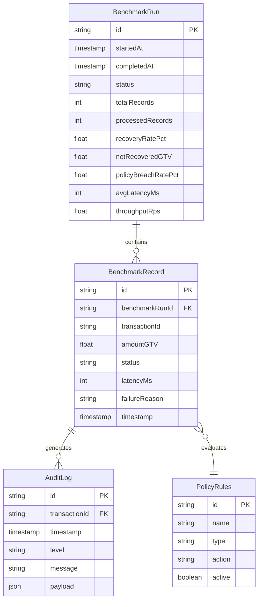

# RevMatrix-AI Ingestion Stream & Fallback Engine

RevMatrix-AI is an autonomous enterprise revenue protection and intelligent cashflow assurance engine. This repository houses the core Live Ingestion Benchmark Runner, SSE (Server-Sent Events) Route Handler, and synthetic payment routing simulator.

---

## System Architecture

The following diagram illustrates the flow of real-time server-sent events (SSE) from the route handler down to the client-side state management and interactive dashboard UI.

```mermaid
graph TD
    Client["Client (LiveBenchmarkStream Component)"] -->|Initiates SSE connection| RouteHandler["SSE Route Handler (/api/benchmark/stream)"]
    RouteHandler -->|Checks & Loads| FileEngine["File/Fallback Engine"]
    FileEngine -->|Reads synthetic_50_failures.json| DataFile[("synthetic_50_failures.json")]
    FileEngine -->|Or falls back to| StaticData["FALLBACK_BENCHMARK_DATA (src/lib/fallback_data.ts)"]
    RouteHandler -->|Paces & streams events (ReadableStream)| Client
    Client -->|Receives Events (START, RECORD_PROCESSED, COMPLETE)| ReactState["React State (records, logs, summary)"]
    ReactState -->|Re-renders metrics & logs| DashboardUI["Interactive Dashboard UI"]
```

---

## Database Schema (ERD)

The entity-relationship diagram below maps out how benchmark runs, processed records, dynamic routing rules, and audit logs are structured in the system.



---

## Local Setup Guide

Follow these steps to run the application locally:

### 1. Install Dependencies
Ensure you have Node.js (v18+) installed. Clone the repository and run:
```bash
npm install
```

### 2. Configure Environment Variables
Copy the `.env.example` file to `.env` and set the required variables:
```bash
cp .env.example .env
```

### 3. Run the Development Server
Start the Next.js development server:
```bash
npm run dev
```
Open [http://localhost:3000/benchmark](http://localhost:3000/benchmark) in your browser.

### 4. Database Setup (Optional)
If running with the Prisma database integration, push the schema:
```bash
npx prisma db push
```

---

## Environment Variable Reference

The application uses the following environment variables:

| Variable Name | Description | Default Value | Required |
| --- | --- | --- | --- |
| `DATABASE_URL` | PostgreSQL connection URL | `postgresql://...` | Yes (for Prisma DB features) |
| `NEXT_PUBLIC_API_URL` | Base API Endpoint URL for client requests | `http://localhost:3000` | No |
| `NEXT_PUBLIC_ENVIRONMENT` | Environment name | `development` | No |

---

## CLI Execution

You can run the synthetic benchmark engine from the command line interface to generate new failure batches:

```bash
# Generate a new synthetic batch of 50 failure cases
npm run generate:data

# Run the benchmark validation suite
npm run benchmark

# Run Vitest scorer assertions
npm run test:benchmark
```
